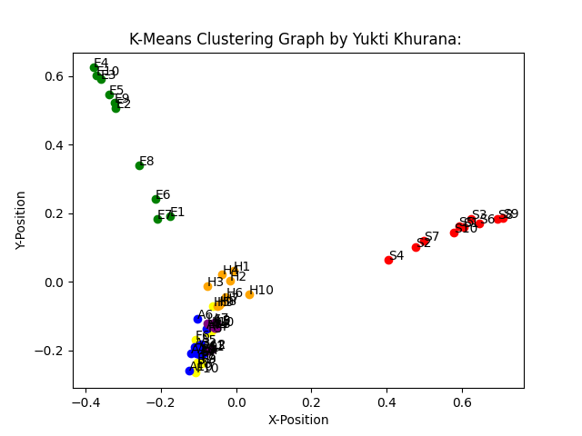

# document_clustering
Document Clustering implementation in python using more than 60 documents samples in broadly 6 categories - SPORTS, ENVIRONMENT,FINANCE, ASTRONOMY & ASTROPHYSICS, HEALTH, SHAKESPEARE:
1. All the documents being used are stored in  "docs" folder
2. cluster.py is the kmeans clustering algorithm implementation being used to cluster docs (uses cosine similarity)
3. cluster2.py is the kmeans clustering algorithm that uses Euclidean distance
4. DocumentClustering.py is the main driver of this model:

	4.1. Both the sklearn K-means clustering algo and my implemented version is being used to cluster documents for comparison of results
  
	4.2. Number of clusters can be decided
  
	4.3 Two available input styles with different docs possible
  

To Execute:

	python3 DocumentClustering.py

Output:

	1. All the output is displayed on the terminal
  
	2. Plot outputs can also be seen in the folder-PlotImages

